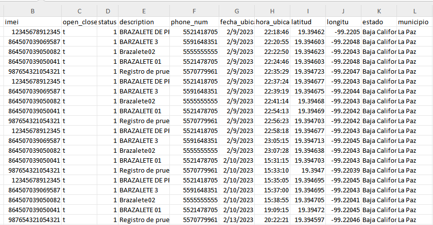
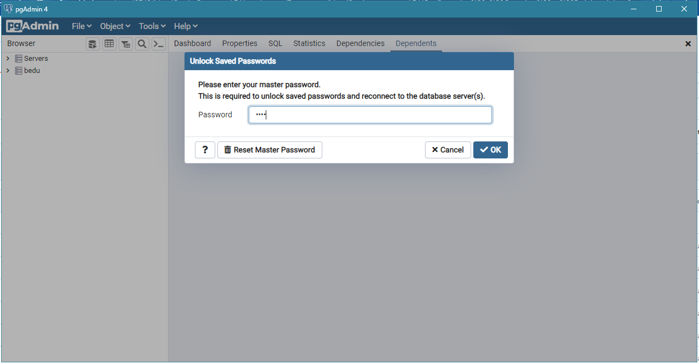
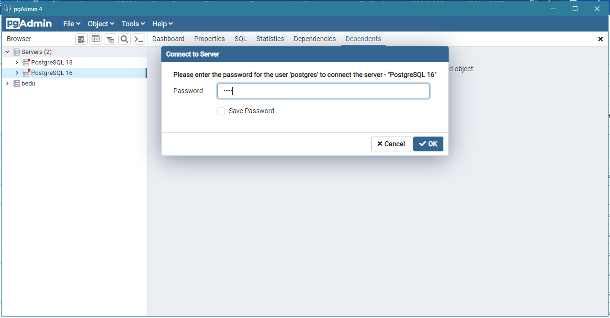
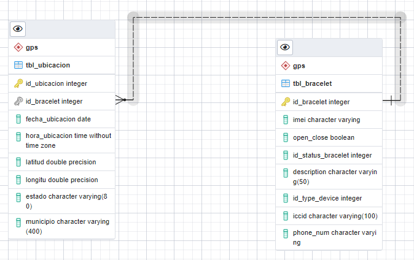
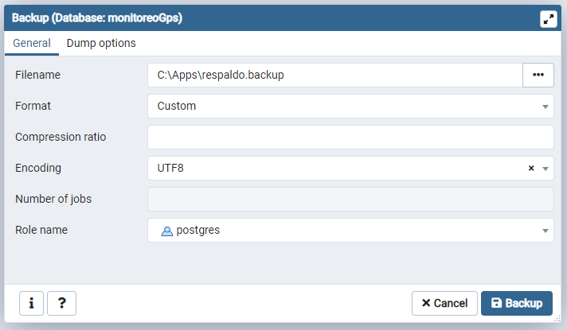
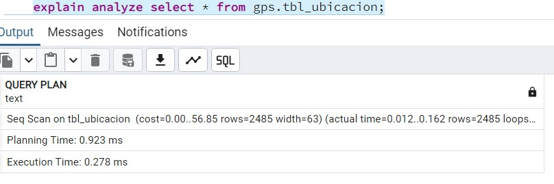
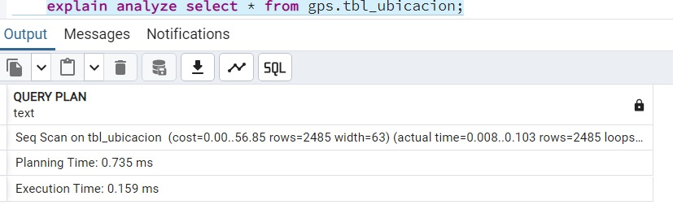

# proyectoPostgres
Se requiere monitorear y visualizar las ubicaciones de objetivos (dispositivos gps).

## 👧 Authors

- [@gabriellagii](https://www.github.com/gabriellagii) 🌻

## 📝 Obtención de datos



- Se crea la base de datos `monitoreoGps` y el esquema `gps`:


## 💻 Configuración del entorno SQL




## ✏️ Diseño de la base de datos

- 1M (un dispositivo a muchas ubicaciones)
  


## 👨 Gestión de usuarios
```bash
CREATE ROLE superadmon LOGIN PASSWORD 'root15' SUPERUSER;

CREATE ROLE createdb LOGIN PASSWORD 'rootdb' CREATEDB;//--ROL PARA SOLO CREAR BASE DE DATOS

CREATE ROLE usersimple LOGIN PASSWORD 'user123';//--ROL USUARIO SIMPLE

ALTER ROLE createdb CREATEROLE; //--ROL DE CRAEAR ROLES

CREATE DATABASE prueba;

SET ROL usersimple;

GRANT createdb TO usersimple;

\du //--- es para ver los roles creados
```

```bash
 CREATE USER superUsuario WITH PASSWORD '123456' 
  ALTER USER superUsuario WITH 
    LOGIN
    SUPERUSER
    INHERIT
    CREATEDB
    CREATEROLE
    REPLICATION
    BYPASSRLS;
```

## 🔐 Creando una copia de seguridad



## 📈 Optimizando consultas

` explain analyze select * from gps.tbl_ubicacion; `




## Preparando un proceso de réplica y alta disponibilidad

## Preparando el monitoreo

## Migración de datos
