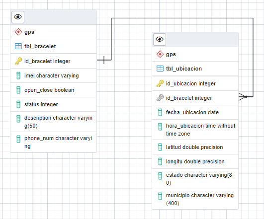
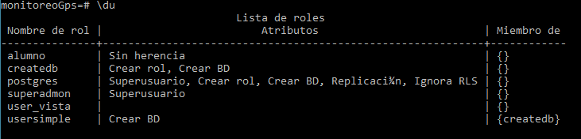

# proyectoPostgres
Se requiere monitorear y visualizar las ubicaciones de objetivos (dispositivos gps).

## 👧 Authors

### Gabriela García Mendoza

- [@gabriellagii](https://www.github.com/gabriellagii) 🌻 

## 📝 Obtención de datos

Se tiene un archivo `.xls` con la información que se requiere para crear la base de datos.


## 💻 Configuración del entorno SQL


- Se actualizó Postgres a versión 16 


## ✏️ Diseño de la base de datos

- 1M (un dispositivo a muchas ubicaciones)
  


```bash
-- This script was generated by a beta version of the ERD tool in pgAdmin 4.
-- Please log an issue at https://redmine.postgresql.org/projects/pgadmin4/issues/new if you find any bugs, including reproduction steps.
BEGIN;
CREATE TABLE IF NOT EXISTS gps.tbl_bracelet
(
    id_bracelet integer NOT NULL,
    imei character varying NOT NULL,
    open_close boolean NOT NULL,
    status integer NOT NULL,
    description character varying(50),
    phone_num character varying,
    PRIMARY KEY (id_bracelet)
);

CREATE TABLE IF NOT EXISTS gps.tbl_ubicacion
(
    id_ubicacion integer NOT NULL,
    id_bracelet integer,
    fecha_ubicacion date,
    hora_ubicacion time without time zone,
    latitud double precision,
    longitu double precision,
    estado character varying(80),
    municipio character varying(400),
    PRIMARY KEY (id_ubicacion)
);
ALTER TABLE gps.tbl_ubicacion
    ADD FOREIGN KEY (id_bracelet)
    REFERENCES gps.tbl_bracelet (id_bracelet)
    NOT VALID;
END;
````

## 👨 Gestión de usuarios
```bash
CREATE ROLE superadmon LOGIN PASSWORD 'root15' SUPERUSER;

CREATE ROLE createdb LOGIN PASSWORD 'rootdb' CREATEDB;//--ROL PARA SOLO CREAR BASE DE DATOS

CREATE ROLE usersimple LOGIN PASSWORD 'user123';//--ROL USUARIO SIMPLE

ALTER ROLE createdb CREATEROLE; //--ROL DE CRAEAR ROLES

CREATE DATABASE prueba;

SET ROL usersimple;

GRANT createdb TO usersimple;

\du //--- es para ver los roles creados
```


```bash
 CREATE USER superUsuario WITH PASSWORD '123456' 
  ALTER USER superUsuario WITH 
    LOGIN
    SUPERUSER
    INHERIT
    CREATEDB
    CREATEROLE
    REPLICATION
    BYPASSRLS;
```


## 🔐 Creando una copia de seguridad


## 📈 Optimizando consultas

` explain analyze select * from gps.tbl_ubicacion; `


```bash
CREATE INDEX ON gps.tbl_ubicacion(id_ubicacion);
```


## Preparando un proceso de réplica y alta disponibilidad

## Preparando el monitoreo

## Migración de datos
